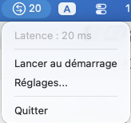

# MenuPing

## What it is ?
Quick Menu bar tool to ping internet at regular intervals and show the response time.

## What does it do ?

Very basic :

* Pings every second www.google.com, this address is configurable
* Can be made persistant, that is launched at session startup

## How to install ?

Have a look at binary and sources available on [the release page](https://github.com/julienbordet/MenuPing/releases/)
* If you run macOS Sequoia or later, install v1.0.0
* If you run an older system, install v0.4.0

## Tested on

For **1.0.0** version

* macOS Tahoe, Apple M1

For **0.4.0** version

* macOS Tahoe, Apple M1
* macOS Sequoia, Apple M1
* macOS Ventura, Apple M1
* macOS Monterey, Apple x86
* macOS Big Sur, Apple x86

Please report an issue if that does work on your system.

## What is the current version

## Star history

