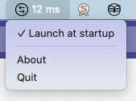

# MenuPing

## What it is ?
Quick Menu bar tool to ping internet at regular intervals and show the response time.

Written in Python, thanks to [rumps](https://github.com/jaredks/rumps) and py2app

## What does it do ? 

Very basic :

* Pings every second www.google.com
* Can be made persistant, that is launched at session startup

## How to install ?

Have a look at binary and sources available on [the release page](https://github.com/julienbordet/MenuPing/releases/)

## What is the current version

The current version is 0.0.1
